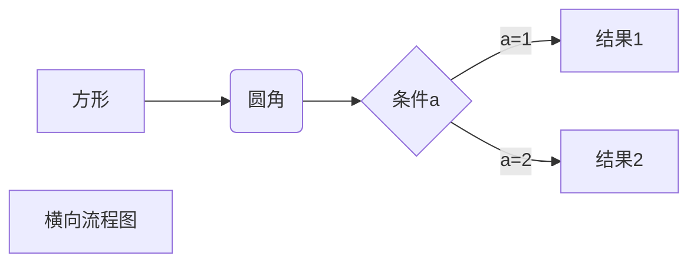
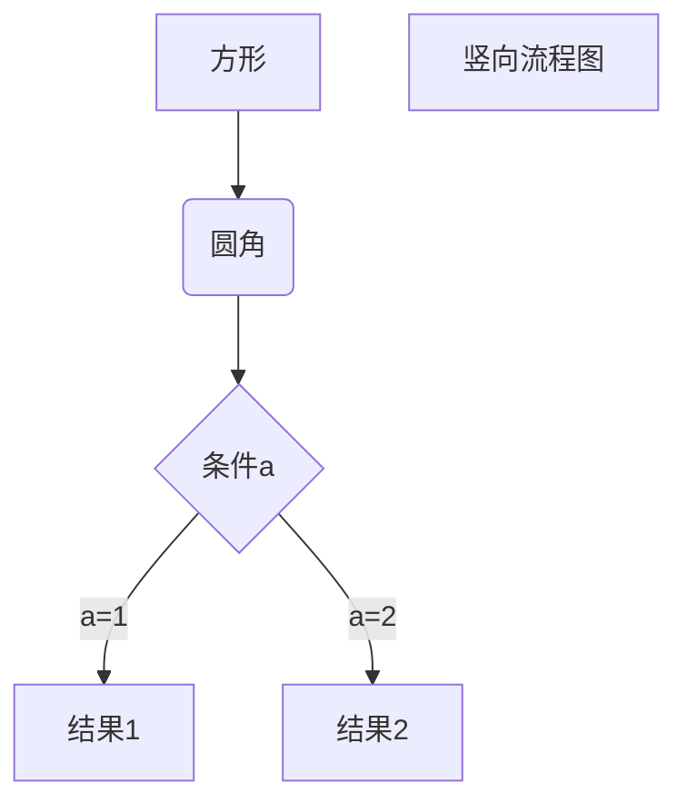
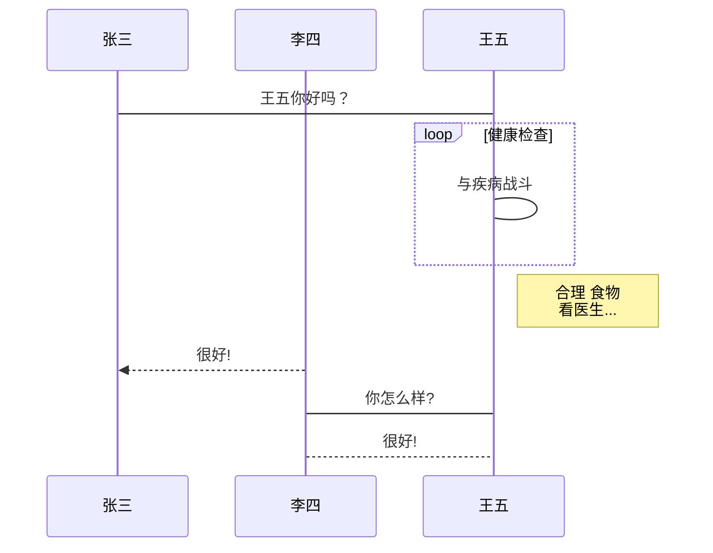
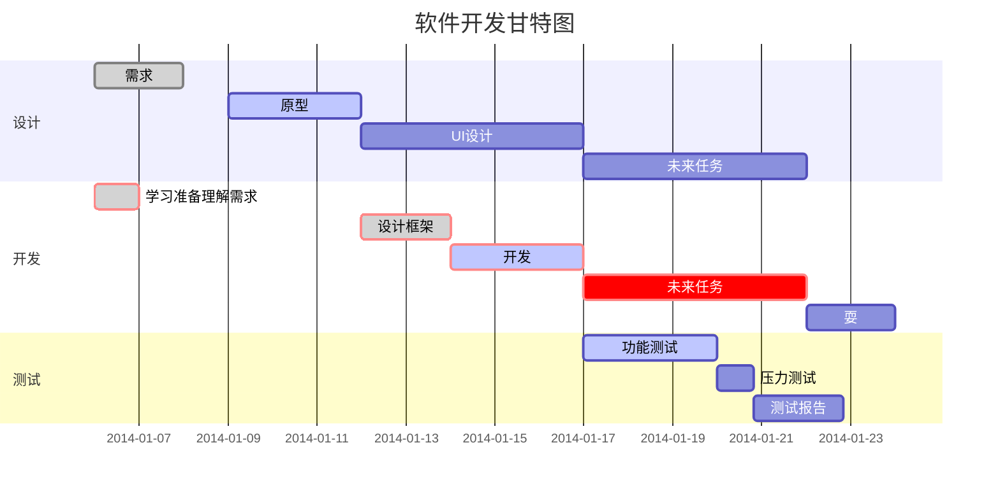

# Markdown的使用

## 1.多级标题

n级标题，前面加n个 #

## 2.段落

段落换行：用两个空格+回车

​        第一段  

​        第二段

## 3.字体

斜体：前后1个*或_，    *斜体文本* _斜体文本_

粗体：前后2* 或 2_ ， **粗体文本**,   __粗体__

粗斜体： 前后 3*  或 3_  ， ***粗斜体文本***  ___粗斜体文本___

## 4.分隔线

一行中用三个以上的星号、减号、底线来建立一个分隔线，行内不能有其他东西。

也可在星号或是减号中间插入空格。下面每种写法都可以建立分隔线：

***

---

___

## 5.删除线

文字的两端加上两个波浪线 **~~**

~~www.baidu.com~~

## 6.下划线

通过 HTML 的 ```<u>```标签来实现

<u>下划线文本</u>

## 7. 脚注

[^要注明的文本]

创建脚注格式类似这样 [^RUNOOB]

[^这是注释]: 学习菜鸟教程

## 8.列表

Markdown支持有序列表、无序列表

无序列表使用(*)、(+)、(-)作为列表标记，标记后加一个空格

* 第一点
* 第二点

+ 第三点 

- 第四点

有序列表，使用数字加上 . 

1. 第一项
2. 第二项

列表嵌套： 

1. 第一项
   - 第一项，第一点
   - 第一项，第二点
2. 第二项
   - 第二项，第一点
   - 第二项，第二点

## 9.区块

段落开头使用 **>** 符号 ，后面一个**空格**，支持分层嵌套

> 区块1
>
> 区块2
>
> > 第一层嵌套，区块中用列表
> >
> > 1. 第一项
> >
> > + 第一条

列表中使用区块，在 **>** 前添加四个空格的缩进

* 第一条  
    > 第一点
    > 第二点
    > 
## 10.Markdown代码
段落上的一个函数或片段的代码可以用**反引号**把它包起来(**`**)，例如：
`printf()`函数

**代码区块**：**4个空格** 或 一个**制表符(Tab)**，例如：
	<?php
	echo 'RUNOOB';
	function test(){
	  echo 'test';
	}
也可以 **```**包裹代码段，并制定语言(也可不指定)
```javascript
$(document).ready(function(){
    alert('RUNOOB');
})
```
## 11.Markdown链接
链接用法：
[链接名称](链接地址)
或者
<链接地址>
例如：
谷歌的链接：[谷歌一下](https://www.google.com)
链接：<https://www.google.com>

**高级链接**
**用变量来设置链接，变量赋值在文末进行：**
这儿用1作为网址变量[Google][1]
这儿用baidu作为网址变量[BaiDu][baidu]
然后在文末为变量赋值(赋值)

[1]:https://www.google.com
[baidu]:https://www.baidu.com
## 12.Markdown图片
图片语法格式：


开头感叹号 !
接着方括号，放图片的替代文字
接着普通括号，放上图片的网址，最后还可以用引号包住加上选择性的 'title' 属性的文字。


也可以像网址那样对图片网址使用变量:
这个链接用 1 作为网址变量 [RUNOOB][2].
在文档的结尾为变量赋值（网址）

[2]: http://static.runoob.com/images/runoob-logo.png


Markdown 没法指定图片高度与宽度，需要的话，可用普通的  标签。


## 13.Markdown表格
用 | 来分隔不同的单元格，使用 - 来分隔表头和其他行，格式如下：
|  表头   | 表头  |
|  ----  | ----  |
| 单元格  | 单元格 |
| 单元格  | 单元格 |

对齐方式：

- **-:** 设置内容和标题栏居右对齐。
- **:-** 设置内容和标题栏居左对齐。
- **:-:** 设置内容和标题栏居中对齐

例如：
| 左对齐 | 右对齐 | 居中对齐 |
| :-----| ----: | :----: |
| 单元格 | 单元格 | 单元格 |
| 单元格 | 单元格 | 单元格 |
## 14.Markdoan高级技巧

### 14.1支持的 HTML 元素

不在 Markdown 涵盖范围之内的标签，都可以直接在文档里面用 HTML 撰写。

目前支持的 HTML 元素有：`<kbd> <b> <i> <em> <sup> <sub> <br>`等 ，如：
支持的 HTML 元素
不在 Markdown 涵盖范围之内的标签，都可以直接在文档里面用 HTML 撰写。

目前支持的 HTML 元素有：```<kbd> <b> <i> <em> <sup> <sub> <br>```等 ，如：
使用 <kbd>Ctrl</kbd>+<kbd>Alt</kbd>+<kbd>Del</kbd> 重启电脑

### 14.2转义

Markdown 使用了很多特殊符号来表示特定的意义，如果需要显示特定的符号则需要使用转义字符，Markdown 使用反斜杠转义特殊字符：
**文本加粗** 
\*\* 正常显示星号 \* \*
Markdown 支持以下这些符号前面加上反斜杠来帮助插入普通的符号：
```
\   反斜线
`   反引号
*   星号
_   下划线
{}  花括号
[]  方括号
()  小括号
#   井字号
+   加号
-   减号
.   英文句点
!   感叹号
```
### 14.3公式
当你需要在编辑器中插入数学公式时，可以使用两个美元符 $$ 包裹 TeX 或 LaTeX 格式的数学公式来实现。提交后，问答和文章页会根据需要加载 Mathjax 对数学公式进行渲染。如：
$$
\mathbf{V}_1 \times \mathbf{V}_2 =  \begin{vmatrix} 
\mathbf{i} & \mathbf{j} & \mathbf{k} \\
\frac{\partial X}{\partial u} &  \frac{\partial Y}{\partial u} & 0 \\
\frac{\partial X}{\partial v} &  \frac{\partial Y}{\partial v} & 0 \\
\end{vmatrix}
${$tep1}{\style{visibility:hidden}{(x+1)(x+1)}}
$$

## 15 typora画流程图、时序图(顺序图)、甘特图
1、横向流程图源码格式：



**2、竖向流程图源码格式：**



**3、标准流程图源码格式：**

```flow
st=>start: 开始框
op=>operation: 处理框
cond=>condition: 判断框(是或否?)
sub1=>subroutine: 子流程
io=>inputoutput: 输入输出框
e=>end: 结束框
st->op->cond
cond(yes)->io->e
cond(no)->sub1(right)->op
```

**4、标准流程图源码格式（横向）：**

```flow
st=>start: 开始框
op=>operation: 处理框
cond=>condition: 判断框(是或否?)
sub1=>subroutine: 子流程
io=>inputoutput: 输入输出框
e=>end: 结束框
st(right)->op(right)->cond
cond(yes)->io(bottom)->e
cond(no)->sub1(right)->op
```

**5、UML时序图源码样例：**

```sequence
对象A->对象B: 对象B你好吗?（请求）
Note right of 对象B: 对象B的描述
Note left of 对象A: 对象A的描述(提示)
对象B-->对象A: 我很好(响应)
对象A->对象B: 你真的好吗？
```

**6、UML时序图源码复杂样例：**

```sequence
Title: 标题：复杂使用
对象A->对象B: 对象B你好吗?（请求）
Note right of 对象B: 对象B的描述
Note left of 对象A: 对象A的描述(提示)
对象B-->对象A: 我很好(响应)
对象B->小三: 你好吗
小三-->>对象A: 对象B找我了
对象A->对象B: 你真的好吗？
Note over 小三,对象B: 我们是朋友
participant C
Note right of C: 没人陪我玩
```
7、UML标准时序图样例：


**8、甘特图样例：**

